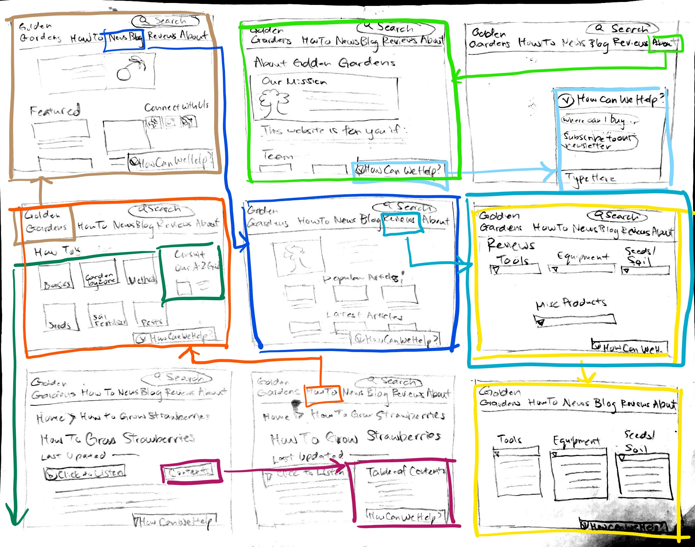

# 05: Low-fidelity prototype (wireflow)
## DH110, Monica Rhee

## Description
My project aims to improve upon the usability and navigation of a site so that it caters to the target user demographic. I intend to create a layout in which both novice and veteran users will feel that is efficient and easy to use. The purpose of this low-fidelity prototype is to provide context and a visual outline to how I intend to accomplish this goal.

## Tasks
The low-fidelity prototype supports the following tasks:

1. Ask for help / ask a question 
2. Look for a guide on how to grow strawberries
5. Search for articles based on the latest

## Wireframes & Wireflow

## Testing the Wireflow
[Link here](https://youtu.be/2fXTxbZl_Z4)

## Reflection
The activity of producing and testing a low-fidelity prototype helps me understand what is whether the information architecture was constructed in a way that was fluid and simple. By observing the participant's behavior, actions and thoughts I am able to envision outside of the design and through the eyes of the target user. For future low-fidelity prototypes I would draw out schematics with larger text and cleaner lines to accomodate any participants who might potentially use it on a smaller device. The reason for enlarging my current prototype is my original participant who is closer to my target user was unable to see and follow the wireframes let alone the wireflow. Based on those two tests, I would like to prioritize a guide that emphasizes text over images however it is difficult to gauge without actual pictures in the low fidleity prototype. The issue arose when the partcipant was looking for a specific topic that was difficult to generalize and select from the available options. Perhaps if the search input field was emphasized a user would see it as an alternative rather than looking up through a directory. 

